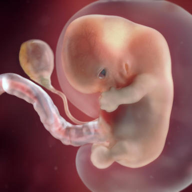

#     How your baby's growing

New this week: Your baby's hands and feet are developing webbed fingers and toes, his eyelids almost cover his eyes, breathing tubes extend from his throat to the branches of his developing lungs, and his "tail" is just about gone. In his brain, nerve cells are branching out to connect with each another, forming primitive neural pathways. You may be daydreaming about having a boy or a girl, but the external genitals haven't developed enough to reveal your baby's sex. (Try our Chinese gender predictor for an early guess!) Either way, your baby – about the size of a kidney bean – is constantly moving and shifting, though you still can't feel it.

###       Your baby is about the size of a kidney bean

#     How your life's changing
You may notice that your bra is getting tight. Soon you'll likely need a larger size with better support. Rising levels of hormones cause breast growth and other tissue changes, all in preparation for lactation. Your breasts may continue to grow throughout pregnancy. Don't be surprised if you go up a cup size or two, especially if it's your first baby. Keep this in mind, and allow for room to grow when buying a new bra.

Feeling fatigued? Hormonal changes – in particular, a dramatic rise in progesterone – may be contributing to your sluggishness. Nausea and vomiting can certainly cost you energy, too. And you may be having trouble getting a good night's sleep, especially if you're uncomfortable or find you need to get up to pee.

"Taking a short 15- to 20-minute walk helped me cope with the overwhelming fatigue that hit me in the first trimester. It was the only way I made it through a day at work without a nap!"
    ### Learn about: First-trimester prenatal tests
Your doctor or midwife will offer you a range of tests during your pregnancy that can help determine whether your baby has Down syndrome and other conditions. Some are relatively simple blood tests (meaning you'll need to give a sample of your blood), while others involve more invasive procedures. All are optional. Before you agree to any test, ask your healthcare provider to explain what it is, how it's done, and what the results will tell you. Many prenatal tests are for screening rather than diagnostic purposes. Screening tests give you a sense of your risk for certain conditions. But only a diagnostic test can tell you for sure whether your baby has a problem. Here are your options during the first trimester:

First-trimester screening: First-trimester screening includes a blood test that measures the levels of two proteins in your blood and a special ultrasound scan called a nuchal translucency (NT) test. The scan is performed between 11 weeks of pregnancy through the end of 13 weeks, and the blood test may be done at the same time or a few weeks earlier. First-trimester screening gives you information about your baby's odds of having Down syndrome and a few other conditions. Although it's not diagnostic, the screening is risk-free and may help you decide whether you want invasive diagnostic testing such as chorionic villus sampling (CVS) or amniocentesis, which carry a slight risk of miscarriage.
NIPT (noninvasive prenatal testing): Another alternative is a blood test that can detect Down syndrome and a few other chromosomal conditions at 10 weeks of pregnancy or later. NIPT is available to all women but has mainly been tested on women at high risk of having a baby with a chromosomal condition. And it's still considered a screening test. That means that if the results indicate a problem, you'll still need CVS or amniocentesis for a definitive diagnosis.
CVS (chorionic villus sampling): This diagnostic test involves collecting cells from the placenta, which are then sent to a lab for genetic analysis. CVS can identify whether your baby has any of hundreds of chromosomal abnormalities and other genetic disorders. It's done in the first trimester, usually between 10 and 12 weeks, making it an earlier alternative to another diagnostic test called amniocentesis, which is done between 16 and 20 weeks.
Get a complete overview of the testing for Down syndrome and other chromosomal abnormalities available to you during your pregnancy.

###      See which activities aren't safe now
You're not going to live in a bubble, of course, but pregnancy is a good time to play it safe. And there are some big no-no's when it comes to activities for expecting moms. Some of them are pretty obvious – no bumper cars, no new tattoos, no hot tubs – but others may surprise you. Find out which activities may be risky now.