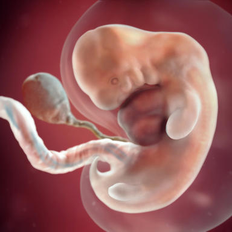

###     How your baby's growing

#     
The big news this week: Your baby's hands and feet are emerging from developing arms and legs – although they look more like paddles at this point than the tiny baby fingers and toes you're daydreaming about holding and tickling. Technically, your baby is still considered an embryo and has something of a small tail, which is an extension of her tailbone. The tail will disappear within a few weeks, but that's the only thing getting smaller. Your baby has doubled in size since last week and now measures half an inch long, about the size of a blueberry.

###     Your baby is about the size of a blueberry

If you could see inside your womb, you'd spot eyelid folds partially covering her peepers, which already have some color, as well as the tip of her nose and tiny veins beneath parchment-thin skin. Both hemispheres of your baby's brain are growing, and her liver is churning out red blood cells until her bone marrow forms and takes over this role. She also has an appendix and a pancreas, which will eventually produce the hormone insulin to aid in digestion. A loop in your baby's growing intestines is bulging into her umbilical cord, which now has distinct blood vessels to carry oxygen and nutrients to and from her tiny body.

###     How your life's changing
Your uterus has doubled in size in the past five weeks, and eating may feel like a chore – or worse – thanks to morning sickness. (If you're feeling fine, don't worry – you're lucky!)

You may need to pee more than usual, too, thanks to your increasing blood volume and the extra fluid being processed through your kidneys. (By now, you already have about 10 percent more blood than you did before you were pregnant. And by the end of your pregnancy, you'll have 40 to 45 percent more blood running through your veins to meet the demands of your full-term baby.) As your uterus grows, pressure on your bladder will send you to the bathroom as well.

About half of the women who feel nauseated during the first trimester will find complete relief by about 14 weeks. (For most of the rest, it'll take another month or so for the queasiness to ease up.) It's unlikely, though, that the need to pee more than usual will change until after your baby's born. In fact, research shows that both the frequency and volume of urine tends to increase over the course of pregnancy.

###    Top 10 signs of pregnancy

Look out for these symptoms, which may appear not long after your missed period. See all videos
Learn about: Prenatal visits
Sometime in the next few weeks is the perfect time to see your healthcare provider for your first prenatal appointment. Good prenatal care helps give your baby a healthy start in life.

###    How should I prepare for my first appointment?

Write down all of your questions and bring them with you so you can use your time effectively and get the professional advice you're hungry for. Mention everything you're feeling or wondering about, no matter how insignificant. Also:

Bring a list of all your medications (prescription and over the counter, including supplements) so your healthcare provider can help you decide whether they're safe to take now.
Look at your calendar and note the first day of your last period. Your doctor or midwife will use this date to estimate your baby's due date. (You can get a good estimate yourself using our due date calculator.) Don't worry if you haven't been keeping track or have irregular periods – your caregiver can schedule an early ultrasound to date your pregnancy.
Consider whether you want to do any prenatal testing to determine your baby's risk of chromosomal or genetic problems. If you didn't have genetic carrier screening before you got pregnant, you may want to have it now. You may also want to consider screening or testing for chromosomal conditions like Down syndrome.
###     What happens during prenatal visits?

Your doctor or midwife will generally start by asking how you're feeling physically and emotionally, whether you have any complaints or worries, and what questions you may have. She'll have other questions as well, which will vary depending on how far along you are and whether she has specific concerns.

The goal of prenatal visits is to see how your pregnancy is going and to provide you with the information you need to help keep you and your baby healthy. Your healthcare provider will check your weight, blood pressure, and urine; measure your abdomen; check the position of your baby; listen to your baby's heartbeat; perform other exams and order tests as appropriate; and closely monitor any complications you may have and intervene if necessary.

At the end of the visit, your provider will review her findings with you, explain the normal changes to expect before your next visit and the warning signs to watch for, counsel you about lifestyle issues (such as the importance of good nutrition and avoiding tobacco, alcohol, and drugs), and discuss the pros and cons of optional tests you may want to consider.

###    Should my partner go with me?

That's up to you. Some couples find that they benefit from going to prenatal visits together – especially the biggies like the first visit, the ultrasound exam, and any time key test results will be revealed. When we asked, 88 percent of pregnant women said they want their partners to attend at least some prenatal appointments with them.

###     How do you feel about it?

Activity: Start taking belly photos
You won't believe how much your belly grows during pregnancy – and you'll love having a visual keepsake that shows your progress! Start by taking a belly photo this week, before you really look pregnant. You can take a belly selfie yourself, using a mirror, or have your partner or a friend help. Tips for a great shot: Consider standing in the same spot and striking the same pose (profiles work best) for each photo. If you have BabyCenter's My Pregnancy & Baby Today app on your phone, you can use the bumpie tool to create and share a series of awesome belly shots.