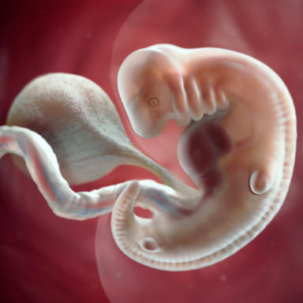

# 

#   **  How your baby's growing**
This week's major developments: The nose, mouth, and ears that you'll spend so much time kissing in eight months are beginning to take shape. If you could see into your uterus, you'd find an oversize head and dark spots where your baby's eyes and nostrils are starting to form. His emerging ears are marked by small depressions on the sides of the head, and his arms and legs by protruding buds. His heart is beating about 100 to 160 times a minute – almost twice as fast as yours – and blood is beginning to course through his body. His intestines are developing, and the bud of tissue that will give rise to his lungs has appeared. His pituitary gland is forming, as are the rest of his brain, muscles, and bones. Right now, your baby is a quarter of an inch long, about the size of a lentil.

#     ** How your life's changing**
You may find yourself developing a bit of a split personality – feeling moody one day and joyful the next. Unsettling as this is (especially if you pride yourself on being in control), what you're going through is normal. Ricocheting emotions are caused partly by fluctuating hormones. But hormones aside, your life is about to change in a big way – and who wouldn't feel emotional about that?

Spotting (spots of blood on your underpants or toilet tissue after urinating) or bleeding is relatively common in early pregnancy, affecting up to a quarter of pregnant women. It may occur in a normal pregnancy, but sometimes it can be the first sign of miscarriage or an ectopic pregnancy. If you have any spotting or bleeding, call your healthcare provider.

"My prenatal vitamins made me sick, so my doctor gave me a prescription for fruit-flavored chewable prenatal vitamins and suggested I take them with meals. 
You may not have heard these important pieces of advice for having a healthy pregnancy. See all videos
Learn about: Your chance of having twins
Twins run in families. You're also more likely to be carrying multiples if you've undergone fertility treatments. But any woman can become pregnant with more than one baby. Could you be one of them?

   Your odds of carrying twins

Overall, about one in 31 births (greater than 3 percent) are twin births. But your chances of having twins are much less – 1 in 89 – if you conceive without medical assistance. The overall odds of bearing triplets or higher-order multiples is about 1 in 565.
Identical twins usually happen by chance. Your likelihood of having identical, or monozygotic, twins (when one fertilized egg divides in half) is about 1 in 250.
A number of factors affect your odds of having fraternal twins (which develop from two eggs, each fertilized by separate sperm cells) or higher-order multiples. Fertility treatments dramatically increase your odds. On average, 20 to 25 percent of women who take fertility drugs or undergo in vitro fertilization or other assisted reproductive techniques end up carrying more than one baby.
Other factors that influence the likelihood of having fraternal twins

Once you have a set of fraternal twins, you're twice as likely to have another set in a future pregnancy.
Fraternal twins run in families, so if you're a twin or related to twins, you're more likely to have a set yourself. Your partner's family history doesn't appear to affect your odds of having twins.
The older you are, the greater your chances of having naturally occurring fraternal twins or higher-order multiples. Hormonal changes are a likely cause.
Fraternal twins are more common than average in African Americans and less common in Hispanics and Asians.
The more pregnancies you've had, the greater your chances of having twins.
Twins are more common in large and tall women than in small women.
When you'll find out whether you're carrying twins

These days, women typically discover they're having more than one baby during an ultrasound, often in the first trimester. If you opt for first-trimester genetic screening, you'll have an ultrasound between 11 and 13 weeks. If you're pregnant as a result of a fertility treatment, you'll probably have an earlier ultrasound (usually within the first eight weeks) to count the embryos that have implanted. Your healthcare provider also will recommend an ultrasound if your uterus is larger than would be expected given the number of weeks since your last period. Ultrasound is almost foolproof at revealing multiple pregnancies, particularly after six to eight weeks. However, the more babies you're carrying, the easier it is for one to get overlooked.

Fertility treatments dramatically increase your odds of having fraternal twins and higher-order multiples. Do you have twins or multiples thanks to fertility treatments?
Activity: Learn which foods and drinks to avoid
During pregnancy it's especially important to skip unsafe foods and drinks that could make you sick or harm your baby. But there's lots of misinformation floating around about what's safe and what's not. You don't want to miss out on healthy foods or stress out about your diet. So get the facts now on which foods and drinks to avoid – we even have a printable chart to keep on your fridge.