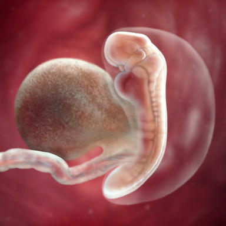

#   **   Five week of pregnancy**
  
 
  
### #  Five weeks, how your baby's growing
Deep in your uterus your embryo is growing at a furious pace. At this point, he's about the size of a sesame seed and looks more like a tiny tadpole than a human. He's now made up of three layers – the ectoderm, the mesoderm, and the endoderm – which will later form all of his organs and tissues.

Small white dishful of sesame seeds on table
5 weeks: Your baby is about the size of a sesame seed
The neural tube – from which your baby's brain, spinal cord, nerves, and backbone will sprout – is starting to develop in the top layer, called the ectoderm. This layer will also give rise to his skin, hair, nails, mammary and sweat glands, and tooth enamel.

His heart and circulatory system begin to form in the middle layer, or mesoderm. (This week, in fact, his tiny heart begins to divide into chambers and beat and pump blood.) The mesoderm will also form your baby's muscles, cartilage, bone, and subcutaneous (under the skin) tissue.

The third layer, or endoderm, will house his lungs, intestines, and early urinary system, as well as his thyroid, liver, and pancreas. In the meantime, the primitive placenta and umbilical cord, which deliver nourishment and oxygen to your baby, are already on the job.

### # How your life's changing
You may notice some pregnancy-related discomforts already. Many women report sore breasts, fatigue, and frequent urination starting in the early weeks. You may also have nausea, though it's more likely to show up in the coming weeks.

The outside world won't see any sign of the dramatic developments taking place inside you – except, perhaps, that you're turning down that glass of wine with dinner.

You'll also want to figure out an appropriate exercise routine, though some women have to put this on hold until first-trimester nausea and exhaustion run their course. Exercise helps you develop the strength and endurance you'll need to manage the extra weight you'll be carrying. It may help prevent some of the aches and pains of pregnancy, and many women find that it's a great stress-reducer. Exercise can also help you get ready for the physical rigors of labor.

Finally, it's easier to bounce back after you give birth if you've continued exercising throughout pregnancy. Choose a safe, moderately vigorous activity you enjoy. Walking and swimming are fine choices for pregnant women.

There are plenty of ways your partner can participate in your pregnancy – even this early in the game. Check out these great tips on how to get involved.

"I found out I was pregnant and boom – my breasts got really tender right away. So I started wearing my sports bra all the time. It really helped ease my discomfort."
- Jennifer
Learn about: Having a healthy pregnancy
These early months of pregnancy are critical for your baby's development. Taking a few key steps now can help protect your baby's health and your own. (Read our complete list of steps for a healthy pregnancy.)

Get early prenatal care and keep up with your appointments. Good prenatal care is essential to your baby's health – and to yours. At your first prenatal visit (usually around eight weeks) you'll be screened for certain conditions that could lead to complications.

Take your prenatal vitamin. Most prenatal supplements contain more folic acid, iron, and calcium than you'll find in a standard multivitamin. Pregnant women need more of these nutrients. (Don't overdo the vitamins, though; more is not necessarily better and in some cases can be dangerous.)

It's vital to get enough folic acid while trying to conceive and during your first trimester because it greatly reduces your baby's risk of developing neural tube birth defects such as spina bifida.

Consult your healthcare provider about the medications you're taking. Many drugs – even some over-the-counter ones – aren't safe during pregnancy. If you take any medications to treat a chronic condition, don't stop them cold turkey but call your healthcare provider right away to review your medication list and find out what's safe and what's not. Mention everything, even supplements and herbs.

Stop smoking. Smoking increases your risk of a host of problems, including miscarriage, placental problems, and preterm birth. It also slows fetal growth and increases the risk of stillbirth and infant death. Some research has even linked smoking to an increased risk of having a baby with a cleft lip or palate.

It's never too late to quit or cut back. Every cigarette you don't light gives your baby a better chance of being healthy. For help, visit BabyCenter's quitting smoking during pregnancy area.

Stop drinking alcohol. As little as one drink a day can increase the odds of low birth weight and raise your child's risk for problems with learning, speech, attention span, language, and hyperactivity. No one knows exactly how harmful even the smallest amount of alcohol may be to a developing baby, so skip alcohol altogether.

Make sure your home and job are safe. Some jobs or hobbies can be hazardous to you and your developing baby. If you're routinely exposed to chemicals, heavy metals (like lead or mercury), certain biologic agents, or radiation, you'll need to make some changes as soon as possible.

Keep in mind that some cleaning products, pesticides, solvents, and lead in drinking water from old pipes can also be harmful. Talk to your doctor or midwife about your daily routine, so you can come up with ways to avoid or eliminate hazards in your home and workplace.

Activity: Make a prenatal appointment
If you haven't done this yet, it's time to choose a doctor or midwife and schedule your first appointment. To prepare, jot down the first day of your last period (so she can determine your due date) and start making a list of any questions that arise.

Talk to relatives on both sides about your families' medical histories. Your healthcare provider will want to know whether any chronic conditions or genetic abnormalities run in either of your families.

Confused about our timing? We begin our pregnancy calculations from the first day of your last period, as do most healthcare providers. So about 3 weeks after fertilization, you're considered to be 5 weeks pregnant.